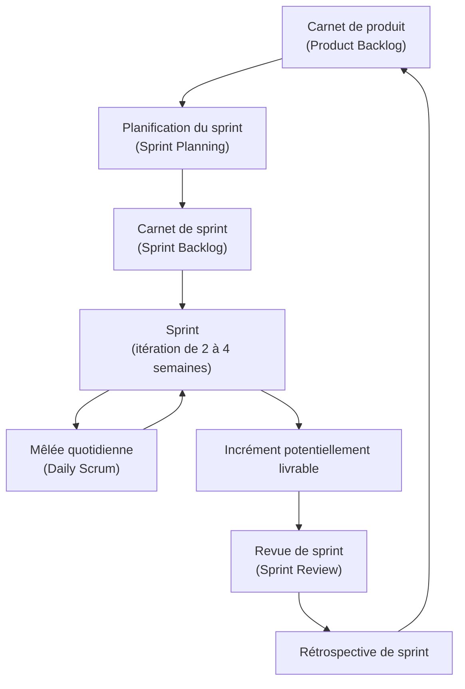

# Chapitre 1 : Étude préalable

## Introduction

Ce chapitre présente Briefly, la problématique, le travail demandé et la démarche de réalisation. Il examine ensuite les outils déjà utilisés par les équipes. L’étude de l’existant débouche sur une solution de principe, décrite au niveau fonctionnel.

## 1.1 Présentation générale du projet

Briefly est un projet de licence *Concepteur développeur d’applications Web* (CDA). Il s’adresse à des équipes qui ont besoin d’une visibilité quotidienne sur le travail en cours, sans plateforme de gestion de projet trop lourde. L’application vise des organisations fermées : agences, petites structures, équipes internes. Un administrateur y crée les comptes.

Briefly est une application web et mobile légère, centrée sur les tâches d’un projet. Elle distingue trois rôles (administrateur, chef d’équipe, membre) et un compte rendu d’avancement structuré. Le besoin qui la justifie est celui du *stand-up* quotidien : savoir ce qui a été réalisé, ce qui vient ensuite et ce qui bloque, puis en tirer un tableau de bord d’avancement. Le chapitre 2 précise les prérogatives de chaque rôle.

### 1.1.1 Problématique

Un écart persiste entre le rituel agile du point quotidien et les outils que les équipes emploient pour le tenir. Dans de nombreuses organisations, le *daily stand-up* se tient en présentiel, en visio ou, plus souvent, sous la forme d’un message Slack ou Microsoft Teams. C’est le principal moment où chacun dit ce qu’il a accompli, ce qu’il compte faire et ce qui l’empêche d’avancer. Le rituel est oral ou textuel, peu structuré et rapidement oublié. Les informations se dispersent dans un fil de conversation. Les blocages ne sont pas distingués des simples commentaires. Le chef d’équipe n’a pas de tableau de bord stable pour mesurer l’avancement d’une équipe, d’un membre ou d’un projet.

Les forges et les tableaux Kanban du marché répondent à d’autres besoins : tracer des tickets, paramétrer des workflows, visualiser un flux de cartes. Le *stand-up* n’y est généralement pas le cœur du produit. Il reste un usage parallèle, souvent improvisé dans la messagerie. La comparaison nominative de ces outils fait l’objet de la section 1.2.

Les équipes ont besoin d’un signal quotidien simple, comparable d’un jour à l’autre, consultable depuis un navigateur comme depuis un téléphone. Les outils du marché surchargent ce besoin, ou le laissent à l’état de message libre. Un blocage signalé oralement n’est pas relié à une tâche. Un taux d’avancement n’est pas calculé. L’administrateur d’une petite organisation n’a pas de vue d’ensemble fiable.

La question que nous retenons est la suivante : comment offrir à une organisation fermée un suivi d’avancement quotidien, structuré autour des tâches, accessible sur le web et sur mobile, avec des rôles nets ? L’outil ne doit pas reprendre la complexité et le coût d’une forge logicielle. Il ne doit pas non plus se limiter à un fil de discussion informel. Briefly se construit comme une réponse à cette question. Il n’existe pas d’entité « brief » quotidienne distincte des tâches. Le *stand-up* est le problème métier à résoudre. La tâche, enrichie de champs d’avancement, en est le support.

### 1.1.2 Travail demandé

Pour cette licence CDA, nous concevons et réalisons Briefly, application de suivi d’avancement pour des équipes internes. Elle existe en client web (Laravel) et en client mobile (Flutter), sur un même backend. Les choix d’architecture et de technologies sont détaillés aux chapitres 3 et 4.

L’organisation cible est fermée : il n’y a pas d’inscription publique, l’administrateur crée les comptes. Trois rôles structurent l’usage : administrateur, chef d’équipe et membre. Le chapitre 2 spécifie leurs prérogatives, y compris le fait que le chef d’équipe ne crée pas les projets. Un utilisateur peut appartenir à plusieurs équipes, un chef peut en diriger plusieurs, un projet peut en impliquer plusieurs.

Les tâches sont le cœur opérationnel. Elles appartiennent à un projet, sont assignées à un utilisateur et portent un statut (à faire, en cours, bloqué, terminé). Elles portent aussi un compte rendu en trois champs (réalisé, à venir, note de blocage) qui reprend les trois questions du *stand-up* en les rattachant à une tâche. Lorsque le statut est « bloqué », la note de blocage est obligatoire. Il n’existe pas d’entité « brief » quotidienne distincte.

Le livrable est une application authentifiée, rôle par rôle, dans laquelle le web et le mobile parlent le même langage métier. Une maquette isolée n’est pas le livrable demandé. L’interface est prévue en français et en anglais, en thème clair et en thème sombre.

### 1.1.3 Méthodologie adoptée

Le choix d’une méthodologie conditionne la qualité du livrable et la manière dont les besoins ont été précisés au fil du travail. Un projet de licence CDA mêle analyse, conception et réalisation itérative. Figer l’intégralité des exigences avant la première ligne de code serait illusoire. Coder sans méthode serait dangereux. Nous restons ouverts à l’ajustement et nous produisons des incréments vérifiables.

#### 1.1.3.1 Choix de la méthodologie

Nous avons retenu une démarche agile, formalisée par Scrum. Le cycle en V, encore enseigné comme référence de planification, suppose un recueil de besoins relativement stable, une conception détaillée préalable et une réalisation linéaire. Briefly est un produit d’usage quotidien. Les écrans de tableau de bord, la formulation des champs d’avancement, le cloisonnement des rôles et le confort mobile ne se valident vraiment qu’au contact d’un incrément utilisable. Une spécification figée trop tôt aurait figé aussi des hypothèses fragiles, notamment sur le périmètre du *stand-up*. Nous avons traité ce périmètre comme un problème d’usage, pas comme une table métier autonome.

Scrum organise le travail. Dans le contexte d’un mémoire de licence, les rôles de *Product Owner*, de *Scrum Master* et d’équipe de développement sont nécessairement concentrés. Nous les distinguons toutefois conceptuellement, afin de ne pas confondre priorisation du besoin, animation de la méthode et production technique.

Nous organisons le travail en sprints de deux à quatre semaines. Chacun débouche sur un incrément potentiellement livrable. Le carnet de produit, le carnet de sprint et l’incrément évitent l’accumulation de fonctionnalités sans priorisation, autant que la livraison unique, trop tardive. La figure 1.1 résume ce cycle. Le tableau 2.1 (chapitre 2) présente le backlog détaillé des cinq sprints. La mêlée du processus de développement n’est pas le *stand-up* que l’application outille : l’une synchronise l’équipe projet, l’autre est le besoin métier.

**Figure 1.1** – Cycle de vie Scrum

Chaque incrément de Briefly a été conçu comme une boucle : planifier, réaliser, inspecter, adapter. La mêlée du processus de développement et le *stand-up* que l’application outille visent le même résultat : rendre le travail visible, nommer les blocages, ajuster la suite.

## 1.2 Étude de l’existant

Nous examinons d’abord les solutions déjà utilisées pour suivre le travail et animer le point quotidien, puis nous formulons la solution proposée. Cette section n’entre pas encore dans les besoins détaillés. Elle établit pourquoi l’existant ne suffit pas et dans quelle direction Briefly s’oriente.

### 1.2.1 Étude de l’existant

Nous avons retenu cinq références représentatives parmi les outils et les pratiques qui occupent aujourd’hui le terrain du suivi d’équipe : une forge logicielle (Jira), un couple d’outils visuels de gestion du travail (Trello, et à titre de comparaison Asana), une plateforme de type « Work OS » (Monday.com), un suivi de tickets moderne (Linear), et enfin la pratique dominante du *stand-up* dans Slack ou Microsoft Teams. Ces références couvrent à la fois les produits spécialisés et le rituel informel qui, dans les faits, les complète ou les remplace.

#### 1.2.1.1 Description des solutions existantes

Pour chaque solution, nous indiquons la fonction, le public visé et les limites au regard du besoin de Briefly.

**Jira**

Jira, édité par Atlassian, est une plateforme de suivi de tickets et de projets, très répandue dans les équipes logicielles. Elle permet de créer des issues, de les organiser en sprints, de définir des workflows, des tableaux, des filtres et des rapports. Les rôles y sont riches : administrateurs de site, administrateurs de projet, développeurs, observateurs. Le paramétrage peut coller à des organisations de grande taille. Une application mobile existe, de même qu’une intégration poussée avec Confluence, Bitbucket ou d’autres outils Atlassian.

Le public visé est d’abord celui des équipes de développement et des directions techniques qui ont besoin d’une traçabilité fine : historique d’une issue, liens entre tickets, estimation, jalons. Jira peut être la source de vérité pour un département entier. En contrepartie, la prise en main est longue, l’interface est dense, et le coût, calculé par utilisateur, devient rapidement dissuasif pour une petite structure. Le *stand-up* n’y est pas un objet de premier plan : on peut filtrer les tickets « bloqués » ou ajouter un commentaire, mais rien n’oblige un membre à renseigner, sur chaque tâche, ce qui a été fait, ce qui suit et ce qui bloque. Le tableau de bord d’avancement existe sous forme de gadgets et de rapports, au prix d’une configuration que peu de petites équipes maîtrisent. Jira résout le suivi de tickets. Il n’outille pas, nativement, le point quotidien léger.

> **Capture à insérer :** `captures/existant-jira.png`

**Figure 1.2** – Interface de Jira Software (à insérer)

**Trello et Asana**

Trello, également dans l’écosystème Atlassian, propose un tableau Kanban simple : listes, cartes, étiquettes, dates et pièces jointes. Asana, souvent cité comme alternative, offre une vue un peu plus structurée (listes, chronologie, charges) tout en restant dans la famille des outils visuels de gestion du travail. L’un et l’autre s’adressent à des équipes qui veulent voir le travail avancer de colonne en colonne, sans investir dans une forge. Le mobile est de bonne qualité, le coût d’entrée est bas, voire nul sur les offres limitées, et l’adoption est rapide.

Trello est visuellement clair. Il manque de structure organisationnelle et d’avancement. Il ne distingue pas nativement un administrateur d’organisation, un chef d’équipe et un membre avec des droits métier différents : on invite des collaborateurs à un tableau. Les blocages se réduisent souvent à une étiquette rouge ou à un commentaire. Trello n’impose pas les champs « réalisé / à venir / note de blocage » et n’offre pas de tableau de bord de taux d’avancement comparable d’une équipe à l’autre. Asana va plus loin sur les responsabilités et les échéances. L’outil coordonne des tâches sans outiller le *stand-up*. Dans les deux cas, l’information quotidienne continue souvent de vivre dans la messagerie.

> **Capture à insérer :** `captures/existant-trello.png`

**Figure 1.3** – Interface de Trello (à insérer)

**Monday.com**

Monday.com se présente comme un « Work OS ». Il propose des tableaux hautement paramétrables, des vues multiples (kanban, chronologie, charge), des automatisations et des tableaux de bord visuels. L’outil s’adresse à des équipes opérationnelles variées (marketing, ressources humaines, production) autant, sinon plus, qu’aux développeurs. La personnalisation et les synthèses graphiques expliquent une partie de l’adoption. Une application mobile accompagne le produit web.

Cette puissance pose problème pour le besoin qui nous occupe. Monday.com demande un travail de conception d’espace de travail avant de produire de la valeur : colonnes, formules, automatisations, tableaux de bord. Le coût par siège est élevé. Les rôles existent, mais ils relèvent davantage de l’administration de la plateforme que d’un modèle métier simple à trois profils. On peut, à force de paramétrage, approximer un suivi de blocages et un taux d’avancement. Rien n’en fait toutefois le cœur du produit. Pour une organisation qui veut seulement que chaque membre tienne à jour trois informations sur sa tâche, Monday.com est disproportionné.

> **Capture à insérer :** `captures/existant-monday.png`

**Figure 1.4** – Interface de Monday.com (à insérer)

**Linear**

Linear est un suivi de tickets moderne, rapide, au design soigné, pensé pour les équipes produit et ingénierie des start-up. Il gère les issues, les cycles, les projets, les vues clavier-first et une application mobile. Le public visé est clairement logiciel. Linear assume d’être un outil de *issue tracking*, à la différence d’un « Work OS » généraliste. La vitesse, la clarté et les opinions assumées en font une référence souvent opposée à Jira.

Linear reste centré sur le ticket et le cycle. Les statuts sont flexibles, les vues sont excellentes, mais les trois questions du *stand-up* n’y sont pas des champs de premier plan, et encore moins une obligation lorsque l’on signale un blocage. Le modèle de rôles et d’équipes est celui d’un workspace d’ingénierie, pas celui d’une petite organisation fermée où seul l’administrateur crée les comptes et les projets. L’offre est payante au-delà d’un usage restreint.

> **Capture à insérer :** `captures/existant-linear.png`

**Figure 1.5** – Interface de Linear (à insérer)

**Le stand-up dans Slack ou Microsoft Teams**

La pratique la plus répandue est un message, parfois automatisé par un robot, dans un canal d’équipe Slack ou Microsoft Teams. Chaque matin, ou à heure fixe, les membres collent un texte du type : « hier… aujourd’hui… bloqué par… ». Des applications du magasin Slack proposent un rappel et un recueil de réponses. Cette solution s’adresse à toute équipe qui a déjà sa messagerie comme place centrale. Elle est immédiate, gratuite au regard du coût de la suite collaborative, et disponible sur mobile de façon native, puisque c’est l’application de chat elle-même.

L’outil est trop pauvre pour le besoin. Le *stand-up* n’est relié à aucune tâche, à aucun statut, à aucun projet. Un blocage écrit dans un canal disparaît sous les messages suivants. Le chef d’équipe ne peut pas ouvrir un tableau de bord de taux d’avancement. Il ne filtre pas les tâches bloquées et ne compare pas les équipes. Il n’y a pas de rôles métier au-delà des permissions du canal. Rien n’empêche un membre d’omettre le blocage, de coller un message vague, ou de cesser de répondre. Briefly remplace cette pratique, utile mais volatile, par un avancement structuré, persistant et rattaché au travail réel.

> **Capture à insérer :** `captures/existant-slack-teams.png`

**Figure 1.6** – Exemple de stand-up dans Slack ou Microsoft Teams (à insérer)

#### 1.2.1.2 Critique de l’existant

Nous comparons ces solutions au besoin posé, sous forme de tableau. Les critères portent sur la nature de l’outil, le traitement des rôles, l’existence d’un client mobile natif, la structuration des blocages, la présence d’un tableau de bord d’avancement, la complexité de prise en main et le coût.

**Tableau 1.1** – Comparaison des solutions existantes au regard du besoin Briefly

| Critère                      | Jira                                           | Trello / Asana                                   | Monday.com                                | Linear                                            | Slack / Teams                             |
| ---------------------------- | ---------------------------------------------- | ------------------------------------------------ | ----------------------------------------- | ------------------------------------------------- | ----------------------------------------- |
| Type d’outil                 | Forge et suivi de tickets                      | Tableaux Kanban / listes de tâches               | Plateforme « Work OS » paramétrable       | Suivi de tickets moderne                          | Messagerie et rituel informel             |
| Rôles organisationnels       | Rôles nombreux, orientés projet et site        | Collaboration à un tableau, rôles métier faibles | Rôles de plateforme, paramétrage lourd    | Rôles d’espace d’ingénierie                       | Permissions de canal, pas de rôles métier |
| Application mobile native    | Oui, secondaire par rapport au web             | Oui, de bonne qualité                            | Oui                                       | Oui, plus limitée                                 | Oui (l’application de chat elle-même)     |
| Bloqueurs structurés         | Étiquettes, flags ou commentaires, non imposés | Étiquettes ou commentaires                       | Colonnes personnalisables, non natives    | Statuts et commentaires                           | Texte libre dans un message               |
| Tableau de bord d’avancement | Rapports puissants, configuration complexe     | Faible en natif (extensions)                     | Tableaux de bord riches après paramétrage | Vues d’équipe, peu centrées « taux d’avancement » | Aucun                                     |
| Complexité de prise en main  | Élevée                                         | Faible à moyenne                                 | Élevée (conception d’espace)              | Moyenne, opinionated                              | Très faible                               |
| Coût                         | Élevé (par utilisateur)                        | Faible / freemium                                | Élevé                                     | Payant au-delà d’un usage restreint               | Inclus dans la suite collaborative        |

Les outils spécialisés (Jira, Monday.com, Linear) savent tracer le travail, parfois avec une grande sophistication. Ils n’imposent pas le compte rendu quotidien en trois champs et ils pèsent par leur complexité ou leur prix. Les outils légers (Trello, Asana) et surtout la messagerie rendent le rituel facile. Ils n’offrent pas de rôles nets, pas de blocage obligatoire, pas de tableau de bord d’avancement comparable. Aucune de ces solutions ne combine, nativement, une organisation fermée à trois rôles, un avancement « réalisé / à venir / note de blocage » rattaché à la tâche, un statut bloqué exigeant une note, des tableaux de bord de taux d’avancement, et un couple web et mobile s’appuyant sur le même backend.

Nous en tirons trois limites. Premièrement, le *stand-up* reste, dans l’existant, soit un sous-produit du ticket, soit un message volatile : l’information quotidienne n’a pas de place première. Deuxièmement, les rôles du marché ne recouvrent pas le découpage dont une petite organisation a besoin, en particulier l’interdiction, pour le chef d’équipe, de créer les projets, et la création exclusive des comptes par l’administrateur. Troisièmement, le mobile est rarement un client de même rang que le web pour ce geste précis : mettre à jour son avancement en quelques champs, consulter un taux d’avancement, signaler un blocage.

### 1.2.2 Solution proposée

Briefly est une application légère de suivi d’avancement, disponible sur le web et sur mobile, destinée à une organisation fermée et à un usage quotidien. Elle se concentre sur un geste : tenir à jour, pour chaque tâche, un avancement lisible par l’équipe, et en dériver des tableaux de bord. Les workflows infinis d’une forge et le remplacement d’une messagerie restent hors périmètre.

Sur le plan organisationnel, Briefly distingue trois rôles (administrateur, chef d’équipe, membre) dans une organisation fermée. Les prérogatives de chacun, ainsi que les multiplicités entre équipes et projets, sont spécifiées au chapitre 2.

Sur le plan métier, la tâche est le support unique de l’avancement (réalisé, à venir, note de blocage). Les tableaux de bord en découlent : le membre voit son propre taux d’avancement, le chef d’équipe celui de ses équipes, l’administrateur celui de l’ensemble.

Sur le plan technique, nous retenons un backend unique Laravel et un client Flutter. Les règles métier restent les mêmes partout. Nous n’entrons pas ici dans la conception détaillée (chapitres 3 et 4).

## Conclusion

Le chapitre 2 analyse et spécifie ces besoins.
