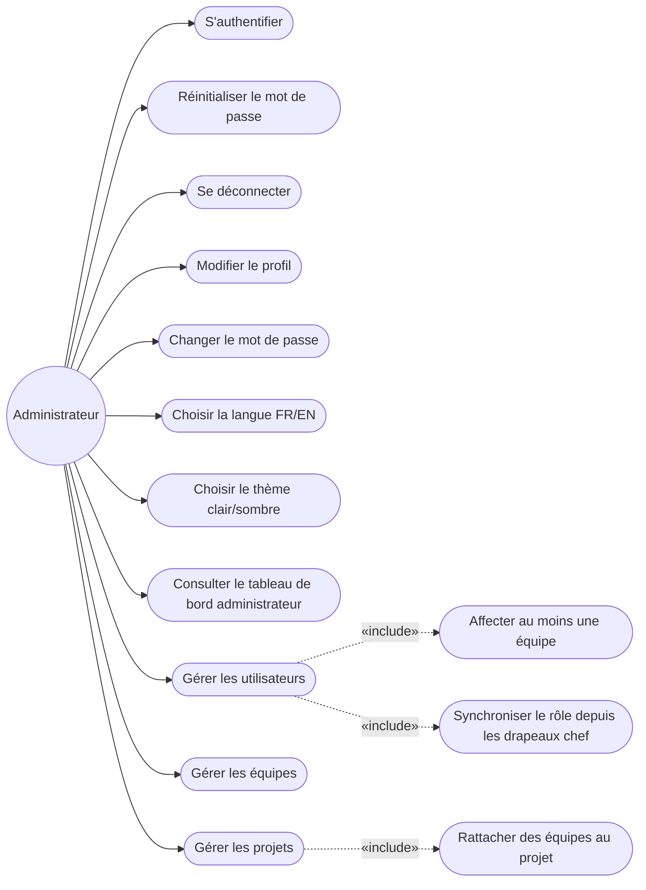
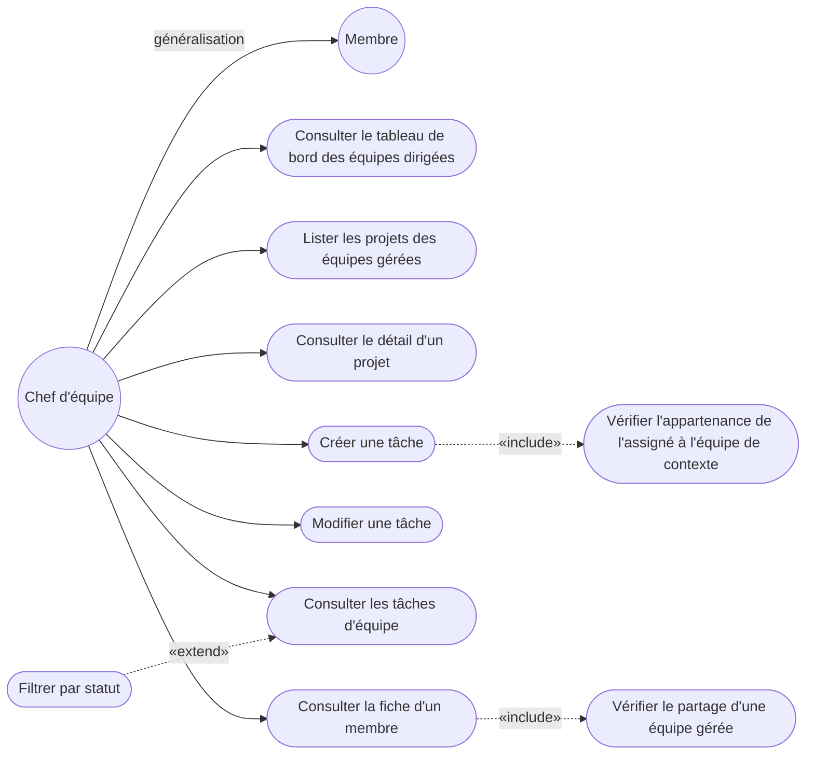
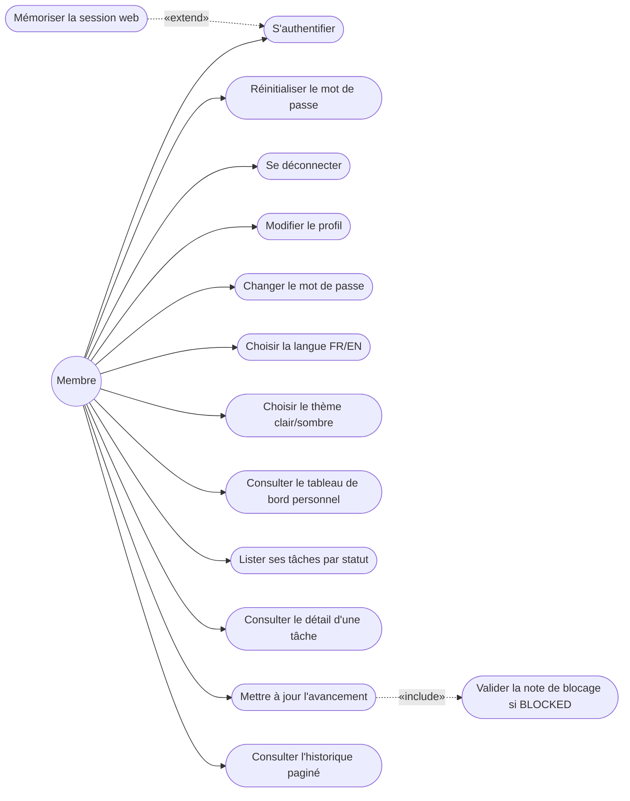
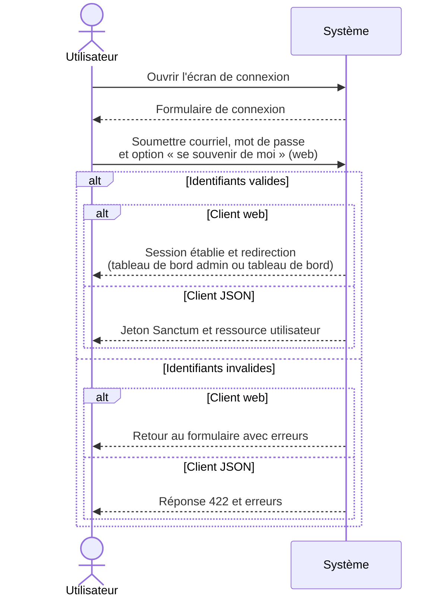
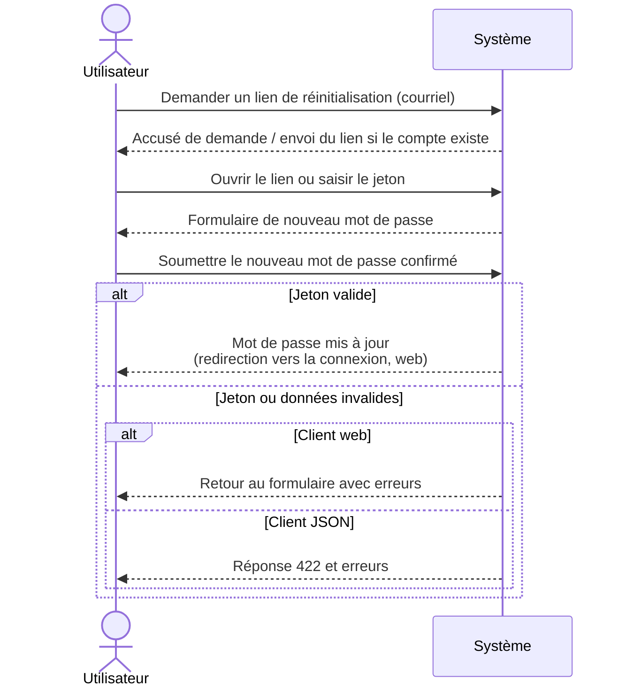

# Chapitre 2 : Analyse et spécification des besoins

## Introduction

Le chapitre 1 a décrit Briefly comme une application interne de suivi d’avancement, fermée à l’inscription publique, destinée à des équipes déjà constituées. Nous en tirons ici des exigences exploitables, d’abord informelles, puis semi-formelles. La conception du chapitre 3 s’appuiera sur cette spécification.

Nous nous appuyons sur le plan Scrum du projet. Les exigences sont décomposées en éléments de backlog et regroupées en sprints. Nous ne reprenons pas les principes généraux de la méthode. Le langage d’analyse retenu est UML. Nous identifions les acteurs, dressons les cas d’utilisation et décrivons, en boîte noire, les interactions entre l’utilisateur et le système. Cette formalisation décrit ce que le système doit permettre. Les objets internes et leur collaboration relèvent du chapitre 3.

La section 2.1 nomme les acteurs, les exigences fonctionnelles par rôle, puis les exigences non fonctionnelles. La section 2.2 propose les diagrammes de cas d’utilisation, les diagrammes de séquences d’analyse, enfin la planification des sprints sous la forme d’un backlog produit.

## 2.1 Spécification informelle des besoins

Nous nommons d’abord les utilisateurs du système et relions chaque exigence à un rôle. L’accès est nominatif, les comptes sont créés par l’administration, et les droits découlent de l’appartenance aux équipes autant que du rôle.

### 2.1.1 Définition des acteurs

Nous retenons trois acteurs. Ils correspondent aux rôles métier distingués par Briefly. Aucun visiteur anonyme n’a de parcours utile au-delà de l’authentification et de la réinitialisation du mot de passe. Il n’existe pas d’auto-inscription.

**L’administrateur** crée et maintient les utilisateurs, les équipes et les projets. Il consulte un tableau de bord global. Il ne gère pas de tâches personnelles. Le middleware `EnsureNotAdmin` ferme les routes de liste, d’historique et de mise à jour des tâches (redirection web vers l’administration, ou refus JSON). Il ne couvre pas `/dashboard`. Les routes de chef d’équipe lui sont refusées (403). Le détail des middleware figure au chapitre 3.

**Le chef d’équipe** (*Team Lead*) est identifié par le drapeau `team_user.is_team_lead`. Un même utilisateur peut diriger plusieurs équipes. En l’état des règles métier, chaque équipe n’a qu’un chef à un instant donné. Le chef d’équipe peut se voir assigner des tâches et en mettre à jour l’avancement, comme un membre. Il ne crée ni les projets, ni les utilisateurs. Ces opérations restent du ressort de l’administrateur.

**Le membre** appartient à une ou plusieurs équipes. Il consulte son suivi, rend compte de l’avancement des tâches qui lui sont assignées et consulte l’historique de ses points d’avancement. Il ne crée pas de tâches pour autrui et ne pilote pas l’équipe. La politique `updateStatus` est explicite : un membre ne peut mettre à jour le progrès que des tâches dont il est l’assigné.

Le chef d’équipe étend le membre pour le suivi d’équipe. Les prérogatives de l’administrateur restent distinctes. L’administrateur n’emprunte pas le parcours d’exécution des tâches.

### 2.1.2 Analyse des besoins fonctionnels

Nous commençons par les fonctions d’authentification et de profil, communes aux trois rôles, puis nous détaillons celles du membre, du chef d’équipe et de l’administrateur.

#### Commun (authentification et profil)

Tous les utilisateurs authentifiables peuvent :

- se connecter au moyen d’une adresse de courriel et d’un mot de passe ;
- cocher, sur le client web, l’option « se souvenir de moi », pour prolonger la session ;
- demander un lien de réinitialisation en cas de mot de passe oublié, puis définir un nouveau mot de passe ;
- se déconnecter ;
- modifier leur nom et leur adresse de courriel ;
- changer leur mot de passe ;
- choisir la langue de l’interface, entre le français et l’anglais ;
- basculer entre un thème clair et un thème sombre.

Sans compte créé par un administrateur, ces parcours restent inaccessibles. Le système ne propose aucun formulaire d’inscription publique.

#### Membre

Le membre accède à un tableau de bord et aux tâches qui lui sont assignées. Il peut :

- consulter un tableau de bord personnel indiquant le taux d’avancement (tâches terminées / total) ainsi que la liste de ses tâches, chacune assortie d’un pourcentage dérivé du statut : à faire (`TODO`) 0 %, en cours (`IN_PROGRESS`) 60 %, bloqué (`BLOCKED`) 30 %, terminé (`DONE`) 100 % ;
- lister ses propres tâches, regroupées par statut ;
- consulter le détail d’une tâche ;
- mettre à jour l’avancement d’une tâche qui lui est assignée, en renseignant le statut, le texte « réalisé » (`progress_done`), le texte « à venir » (`progress_next`) et, le cas échéant, la note de blocage (`blocker_note`). Cette dernière est obligatoire lorsque le statut choisi est `BLOCKED` ;
- consulter l’historique de ses points d’avancement, sous la forme d’une liste paginée d’enregistrements `TaskUpdate`.

Le membre ne modifie pas le titre, la description ou l’assigné d’une tâche. Ces attributs relèvent du chef d’équipe. Le geste métier du membre est le *point d’avancement* structuré.

#### Chef d’équipe

Le chef d’équipe hérite des besoins du membre pour ses propres tâches. Il pilote uniquement les équipes dont il est le chef. Il peut :

- consulter, sur son tableau de bord, chaque équipe dirigée, avec les statistiques suivantes : total des tâches, tâches en cours, tâches bloquées, tâches terminées dans la semaine (`done_this_week`), taux d’avancement, ainsi que les dernières tâches bloquées. Il n’y a pas de carte dédiée aux tâches terminées hors de ce décompte hebdomadaire ;
- lister les projets rattachés aux équipes qu’il gère ;
- consulter le détail d’un projet et y créer une tâche (titre, description, assigné, statut), l’assigné devant appartenir à l’équipe de contexte ;
- modifier une tâche existante relevant des équipes qu’il dirige ;
- consulter les tâches d’équipe, avec un filtre par statut ;
- consulter la fiche d’un membre (tâches et mises à jour récentes), uniquement si ce membre partage une équipe gérée par le chef.

Le chef d’équipe ne crée ni projets ni utilisateurs. Il n’administre pas le référentiel. Il organise le travail à l’intérieur des projets déjà rattachés à ses équipes et lit l’avancement de ses membres.

#### Administrateur

L’administrateur gère la structure (utilisateurs, équipes, projets) et consulte une vue d’ensemble. Il peut :

- consulter un tableau de bord administrateur : effectifs (équipes, projets, tâches), taux d’avancement global, graphique de répartition par statut, listes de taux d’avancement par équipe et par projet ;
- gérer les utilisateurs non administrateurs : création, consultation et mise à jour (nom, intitulé de poste, courriel et mot de passe à la création, identifiants d’équipes avec un minimum d’une équipe, identifiants de chef d’équipe nécessairement inclus dans les équipes sélectionnées). Un nouvel utilisateur est créé en tant que membre ; son rôle est ensuite synchronisé à partir des drapeaux de chef d’équipe. Le compte administrateur n’apparaît pas dans cette liste ; le formulaire ne permet pas de le réaffecter ;
- gérer les équipes : création, consultation et mise à jour (nom, chef, membres, projets rattachés) ;
- gérer les projets et y rattacher des équipes : création, consultation et mise à jour.

L’administrateur ne gère pas de tâches personnelles. S’il emprunte les routes d’exécution, le système le ramène vers son tableau de bord.

### 2.1.3 Analyse des besoins non fonctionnels

Nous retenons les besoins non fonctionnels suivants, qui contraignent autant la conception que la réalisation.

Sur le plan de la sécurité, Briefly est une application fermée. L’authentification web s’appuie sur une session. L’authentification JSON, destinée au client mobile, s’appuie sur un jeton. L’administration, le pilotage d’équipe et l’exécution des tâches sont cloisonnés par rôle. Les politiques d’accès précisent, au-delà du simple rôle, qui peut voir, créer ou modifier une ressource. Un chef ne voit un projet que s’il est rattaché à l’une de ses équipes. Un membre ne met à jour que ses propres tâches. Les formulaires web sont protégés contre les attaques CSRF. Le détail des middleware et des politiques relève de la conception (chapitre 3).

L’information d’avancement est présentée par regroupement par statut, pourcentages dérivés, tableaux de bord différenciés selon le rôle, filtre des tâches d’équipe et fiche membre. Les parcours d’erreur (identifiants invalides, note de blocage manquante) renvoient l’utilisateur vers le formulaire avec un message explicite.

L’interface est disponible en français et en anglais. Côté web, le choix de langue est mémorisé en session (`/locale/fr` ou `/locale/en`) et s’applique aux libellés comme aux messages de validation. Côté mobile, la langue est locale à l’appareil. Elle ne modifie pas la locale du serveur Laravel.

Les règles métier (qui peut assigner, qui peut mettre à jour un statut, qui peut voir une fiche membre) vivent côté serveur. Un nouveau client ne doit pas les réimplémenter. Le drapeau `is_team_lead` permet d’étendre le nombre d’équipes dirigées sans inventer un quatrième acteur.

Les listes d’historique sont paginées. Les tableaux de bord s’appuient sur des agrégats (comptages, taux) et n’y versent pas l’historique complet. Ces choix visent un temps de réponse acceptable pour un usage quotidien, y compris lorsque plusieurs équipes et projets coexistent.

En tant qu’outil interne de suivi, l’application doit rester joignable pendant les plages de travail des équipes. L’indisponibilité de l’authentification ou des tableaux de bord priverait les membres de leur point d’avancement et les chefs de leur vue d’ensemble.

Briefly s’adresse à un client web et à un client mobile. Les deux clients exposent les mêmes droits et les mêmes invariants (assigné membre de l’équipe de contexte, note de blocage obligatoire, redirection de l’administrateur, etc.). La logique métier est spécifiée une fois, puis servie aux deux canaux.

## 2.2 Spécification semi-formelle

Nous poursuivons en UML d’analyse. Les diagrammes de cas d’utilisation donnent une vue d’ensemble par acteur. Les diagrammes de séquences décrivent, en boîte noire, l’authentification et le mot de passe oublié. Le backlog produit traduit ces exigences en sprints.

### 2.2.1 Diagrammes de cas d’utilisation

UML ne dispose pas, dans la notation Mermaid retenue pour ce mémoire, d’un type « use case » natif. Nous représentons les acteurs par des cercles et les cas d’utilisation par des ovales, selon un `flowchart LR`. Les relations « include » et « extend » n’apparaissent que lorsqu’elles correspondent à une règle réelle du système.

**Figure 2.1 : Cas d’utilisation de l’administrateur**

L’administrateur s’authentifie, gère son profil, puis opère exclusivement dans l’administration. La création d’un utilisateur inclut l’affectation d’au moins une équipe et la synchronisation du rôle à partir des drapeaux de chef. La gestion des projets inclut le rattachement d’équipes.

**Figure 2.2 : Cas d’utilisation du chef d’équipe**

Le chef d’équipe hérite des cas du membre (généralisation) : tableau de bord personnel, tâches assignées, points d’avancement. Les cas propres au pilotage s’y ajoutent. La création d’une tâche inclut la vérification que l’assigné appartient à l’équipe de contexte. La consultation d’une fiche membre inclut la vérification d’une équipe gérée en commun. Le filtre par statut étend la consultation des tâches d’équipe.

**Figure 2.3 : Cas d’utilisation du membre**

Le membre s’authentifie, gère son profil, puis travaille sur son suivi personnel. La mise à jour d’avancement inclut la validation de la note de blocage lorsque le statut retenu est `BLOCKED`. L’option « se souvenir de moi » étend l’authentification web.

Les figures n’incluent pas la création de projet par le chef d’équipe, l’auto-inscription, ni la gestion de tâches personnelles par l’administrateur.

### 2.2.2 Diagrammes de séquences (analyse, boîte noire : utilisateur ↔ système)

Seuls l’utilisateur et le système apparaissent. Les collaborations internes (services d’administration, service des tâches, politiques) relèvent de la conception et seront traitées au chapitre 3.

**Figure 2.4 : Authentification**

**Pré-conditions.** Un compte a été créé par un administrateur. L’utilisateur n’est pas authentifié, ou sa session (respectivement son jeton) a expiré. Il connaît l’adresse de courriel associée au compte.

**Scénario nominal.**

1. L’utilisateur ouvre l’écran de connexion.
2. Il saisit son courriel et son mot de passe.
3. Sur le client web, il peut cocher « se souvenir de moi ».
4. Il soumet le formulaire.
5. Le système vérifie les identifiants.
6. En cas de succès :
   - sur le client web, le système établit une session et redirige vers le tableau de bord administrateur si l’utilisateur est administrateur, vers le tableau de bord personnel sinon ;
   - sur le client JSON, le système émet un jeton Sanctum et renvoie ce jeton ainsi que la ressource utilisateur.
7. En cas d’échec (identifiants invalides) :
   - sur le client web, le système renvoie l’utilisateur au formulaire, avec les erreurs, sans réafficher le mot de passe ;
   - sur le client JSON, le système répond par le code 422, accompagné du message et des erreurs.

**Post-conditions (succès).** L’utilisateur est authentifié. Une session web est active, ou un jeton JSON a été émis. L’utilisateur se trouve devant le tableau de bord correspondant à son rôle : tableau de bord administrateur, ou tableau de bord de suivi (membre / chef d’équipe). **Post-conditions (échec).** Aucune session durable n’est créée ; aucun jeton n’est émis ; l’utilisateur reste sur le parcours d’authentification.

**Figure 2.5 : Mot de passe oublié**

**Pré-conditions.** L’utilisateur n’est pas authentifié. Il dispose de l’adresse de courriel de son compte.

**Scénario nominal.**

1. L’utilisateur demande un lien de réinitialisation en saisissant son courriel.
2. Le système enregistre la demande et, si l’adresse correspond à un compte, envoie un message contenant un jeton et un lien.
3. L’utilisateur ouvre le lien (ou saisit le jeton, côté mobile).
4. Il choisit un nouveau mot de passe, confirmé, d’une longueur minimale de huit caractères.
5. Le système vérifie le jeton, met à jour le mot de passe et confirme le succès.
6. L’utilisateur peut alors s’authentifier avec le nouveau mot de passe.

En cas d’adresse inconnue, le système refuse la demande avec une erreur de validation visible (retour au formulaire côté web, code 422 côté JSON). L’existence du compte n’est pas masquée. En cas de jeton invalide, le mot de passe n’est pas modifié.

**Post-conditions (succès).** Le mot de passe du compte est remplacé ; les anciennes sessions « se souvenir de moi » ne suffisent plus à elles seules à garantir l’accès avec l’ancien secret. L’utilisateur n’est pas encore reconnecté : il doit s’authentifier. **Post-conditions (échec).** Le mot de passe antérieur demeure ; aucun accès n’est accordé.

Les enchaînements impliquant les services internes, les politiques et les agrégats de tableau de bord seront formalisés au chapitre 3.

### 2.2.3 Planification des sprints

L’analyse se traduit en un backlog produit, découpé selon le plan Scrum du projet. Chaque sprint livre un ensemble cohérent, dans l’ordre des dépendances : le socle d’accès d’abord, puis l’exécution membre, le pilotage chef d’équipe, l’administration, enfin le second client. Les durées ci-dessous correspondent au calendrier 2026 du mémoire.

**Tableau 2.1 : Backlog du produit**

| Nom de sprint | Tâches | Durée |
| --- | --- | --- |
| Sprint 1 : Authentification, profil, langue et thème | Connexion par courriel et mot de passe ; option « se souvenir de moi » (web) ; déconnexion ; mot de passe oublié et réinitialisation ; modification du nom et du courriel ; changement de mot de passe ; bascule français / anglais ; thème clair / sombre ; absence d’auto-inscription | du 2 au 15 février 2026 (2 semaines) |
| Sprint 2 : Espace membre | Tableau de bord personnel, liste et détail des tâches, mise à jour d’avancement (note de blocage obligatoire si statut bloqué), historique paginé ; restriction de la mise à jour à l’assigné | du 16 février au 1er mars 2026 (2 semaines) |
| Sprint 3 : Espace chef d’équipe | Enrichissement du tableau de bord par équipe dirigée (totaux, en cours, bloquées, terminées dans la semaine, taux, dernières tâches bloquées) ; liste des projets des équipes gérées ; détail de projet ; création de tâche (titre, description, assigné membre de l’équipe de contexte, statut) ; modification de tâche ; vue des tâches d’équipe avec filtre de statut ; fiche membre conditionnée au partage d’une équipe gérée ; exclusion de la création de projets et d’utilisateurs | du 2 au 15 mars 2026 (2 semaines) |
| Sprint 4 : Espace administrateur | Tableau de bord administrateur (effectifs, taux global, graphique de statuts, taux par équipe et par projet) ; création, consultation et mise à jour des utilisateurs (équipe minimale, drapeaux chef, rôle initial membre puis synchronisation, interdiction de réaffecter un administrateur) ; gestion des équipes ; gestion des projets et rattachement d’équipes ; redirection `EnsureNotAdmin` hors des routes d’exécution | du 16 au 29 mars 2026 (2 semaines) |
| Sprint 5 : Application mobile Flutter | Client mobile consommant les mêmes parcours (authentification par jeton, profil, espaces membre, chef d’équipe et administrateur) sans dupliquer les règles métier déjà spécifiées côté serveur | du 30 mars au 19 avril 2026 (3 semaines) |

Ce découpage ordonne la livraison des exigences déjà analysées. Le sprint 5, plus long, expose ce métier sur un second canal.

## Conclusion

Les trois acteurs du §2.1.1, les exigences non fonctionnelles et la spécification UML d’analyse (cas d’utilisation, séquences en boîte noire) constituent, avec le backlog Scrum (tableau 2.1), le cahier des charges interne du projet. Le chapitre 3 en déduit les architectures, les modèles et les collaborations d’objets.
