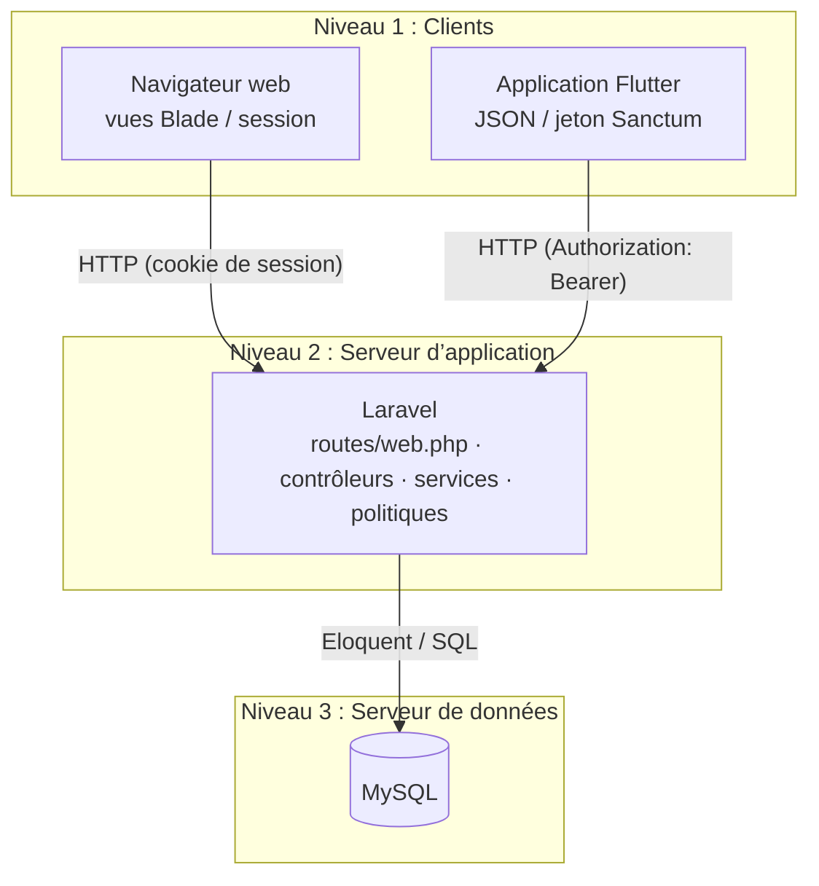
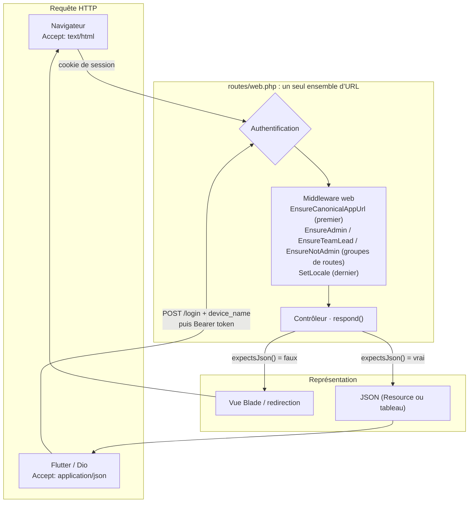
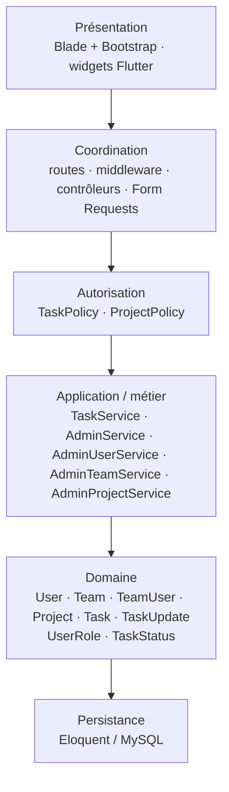
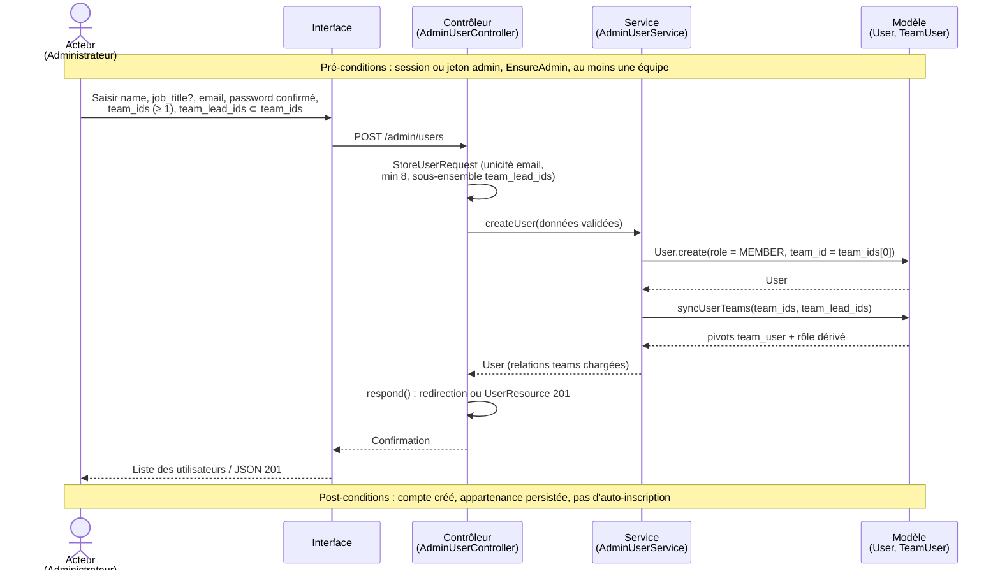
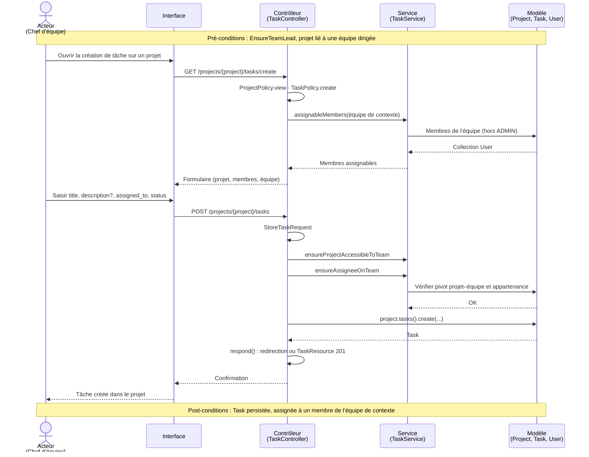
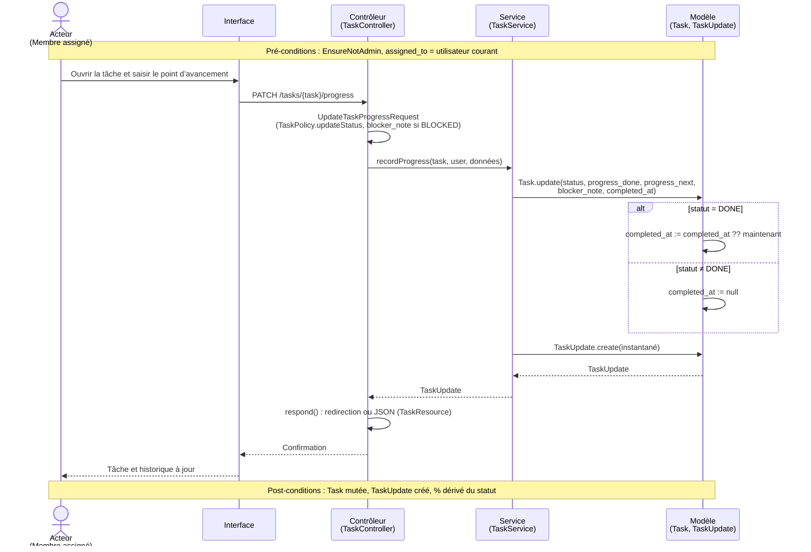
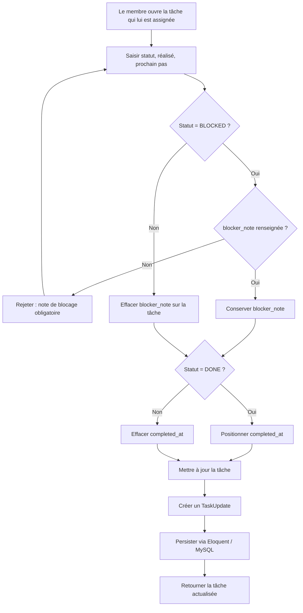
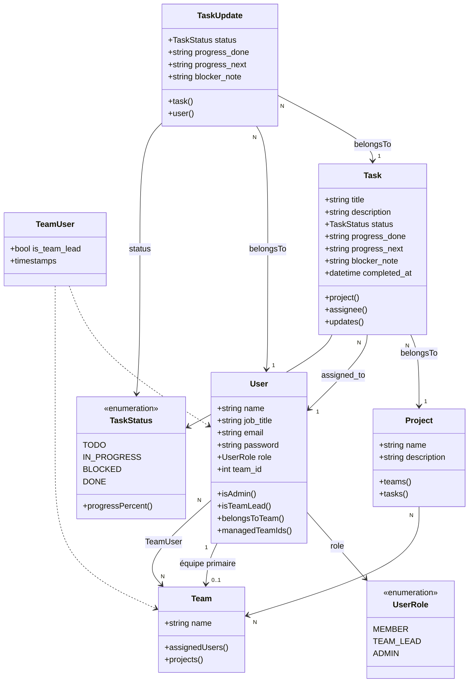
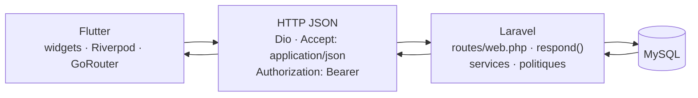

# Chapitre 3 : Conception

## Introduction

Le chapitre 2 a fixé le périmètre fonctionnel de Briefly et les exigences qui en découlent. Nous traduisons ici ces spécifications en une architecture et en des collaborations d’objets assez précises pour orienter la réalisation. Le texte qui suit décrit comment le système est structuré, du déploiement physique jusqu’aux règles métier encapsulées dans les services et les politiques d’autorisation.

Nous concevons Briefly comme une application interne unique, exposée au navigateur et à l’application Flutter, et servie par un même serveur Laravel. Les règles de validation, d’autorisation et de persistance restent une source de vérité unique, que la requête arrive d’un formulaire Blade ou d’un appel JSON. La conception détaillée formalise cette organisation, d’abord à l’échelle globale (architectures physique et logique), puis à l’échelle des collaborations (séquences, activité, classes) et enfin du client mobile.

La section 3.1 présente l’architecture globale : le déploiement 3-tiers, le protocole de communication unifié et le découpage logique en couches Laravel. La section 3.2 descend au niveau des objets : trois scénarios métier représentatifs, le flux d’activité de mise à jour d’une tâche, le modèle de classes du domaine, puis l’architecture du client Flutter.

## 3.1 Conception globale

Cette section pose où s’exécute chaque responsabilité, comment les clients dialoguent avec le serveur, et selon quelles couches le code applicatif est organisé. Les collaborations de la section 3.2 s’appuient sur ces frontières.

### 3.1.1 Architecture physique

Nous retenons une architecture physique **3-tiers**. Les responsabilités de présentation, de traitement et de persistance sont déployées sur des niveaux distincts.

Le **premier niveau** est celui des clients. Deux supports d’interface coexistent : le navigateur, qui affiche les vues Blade produites par Laravel, et l’application mobile Flutter, qui interprète des réponses JSON. Ces deux clients n’embarquent pas le métier. Ils formulent des requêtes HTTP vers le même serveur et en restituent le résultat.

Le **deuxième niveau** est le serveur d’application Laravel. Il accueille le routage, l’authentification, l’autorisation, la validation, les services métier et l’accès aux modèles. C’est à ce niveau que se concentrent les règles que nous ne voulons pas dupliquer.

Le **troisième niveau** est le serveur de données MySQL. Il conserve les utilisateurs, les équipes, les projets, les tâches et l’historique des points d’avancement. Les clients n’y accèdent jamais directement.

**Figure 3.1 : Architecture physique de Briefly (déploiement 3-tiers)**

Ce découpage se justifie, dans le contexte de Briefly, par trois critères.

**Flexibilité.** Les deux clients évoluent à des rythmes différents : le web s’appuie sur Blade et Bootstrap, le mobile sur des widgets Flutter, GoRouter et Riverpod. En isolant la présentation, nous pouvons enrichir l’un sans republier l’autre, tant que le contrat HTTP demeure stable. Le serveur d’application peut être déployé, mis à l’échelle ou mis à jour indépendamment du schéma de données, dès lors que les migrations Eloquent restent maîtrisées.

**Sécurité.** Les identifiants MySQL, les hachages de mots de passe et les jetons d’accès ne quittent pas le périmètre serveur. Les clients ne voient que ce que les ressources JSON ou les vues Blade exposent. L’autorisation (politiques, middleware de rôle) s’exerce *avant* tout accès aux modèles, ce qui empêche un client, même authentifié, d’outrepasser son rôle en appelant directement la base. L’absence d’auto-inscription, déjà posée au chapitre 2, se traduit par un point d’entrée unique : la création d’utilisateur est une opération d’administration, pas une route publique.

**Performance.** Le serveur d’application concentre les requêtes Eloquent (chargement des relations, statistiques de tableaux de bord, pagination de l’historique) et évite aux clients de multiplier les allers-retours vers MySQL. Le navigateur bénéficie du rendu serveur pour les pages métier ; le mobile ne télécharge que le JSON nécessaire. MySQL reste libre d’être dimensionné (index, moteur InnoDB) sans imposer ces contraintes aux clients.

#### Communication unifiée : un seul fichier de routes, deux représentations

Briefly ne dispose pas d’un fichier de routes API distinct. L’ensemble des URL métier est déclaré dans `routes/web.php`. Les contrôleurs héritant de la classe de base `Controller` s’appuient sur la méthode `respond()` : si la requête `expectsJson()` (en pratique, si l’en-tête `Accept: application/json` est présent), le serveur renvoie du JSON ; sinon, une vue Blade ou une redirection. Selon les endpoints, ce JSON est soit une *Eloquent API Resource*, soit un tableau assemblé à partir de `resolve()` sur ces ressources.

Cette stratégie unifie le contrat d’URL. Une création de tâche, une mise à jour d’avancement ou une consultation de tableau de bord empruntent le même chemin HTTP, que l’acteur soit devant un navigateur ou devant l’application Flutter. Les règles de validation (Form Requests) et d’autorisation (politiques, middleware) s’appliquent une seule fois.

L’authentification se dédouble selon le client, tout en restant branchée sur les mêmes routes protégées par le middleware `auth:web,sanctum` :

- **Web.** L’authentification repose sur la session Laravel. Après un `POST /login` réussi, la session est régénérée et l’utilisateur est redirigé vers le tableau de bord administrateur ou opérationnel selon son rôle.
- **Mobile.** Le même `POST /login`, accompagné d’un champ `device_name` et d’un `Accept: application/json`, provoque la création d’un *personal access token* Sanctum. Les requêtes suivantes portent l’en-tête `Authorization: Bearer`. Un `POST /logout` JSON supprime le jeton courant (`currentAccessToken()->delete()`), invalide éventuellement la session associée, et répond sans contenu.

Les requêtes munies d’un jeton Bearer sont exemptées de la vérification CSRF, ce qui rend le client mobile viable sans cookie de session. Les routes d’authentification JSON (`login`, `forgot-password`, `reset-password`) le sont également, afin que Flutter puisse obtenir un jeton avant toute session.

**Figure 3.2 : Communication unifiée entre clients et serveur Laravel**

**Tableau 3.1** – Middleware d’accès

| Middleware | Rôle de conception |
|---|---|
| `EnsureCanonicalAppUrl` | Exécuté en premier dans le groupe web. Redirige les requêtes HTML vers l’URL canonique (`APP_URL`). Les requêtes JSON et celles portant un jeton Bearer sont laissées passer, pour ne pas casser le client mobile. |
| `EnsureAdmin` | Filtre de groupe : réserve le préfixe `/admin` aux utilisateurs de rôle `ADMIN`. |
| `EnsureTeamLead` | Filtre de groupe : réserve la création et l’édition de tâches, ainsi que la vue d’équipe, aux chefs d’équipe. |
| `EnsureNotAdmin` | Filtre de groupe : écarte l’administrateur de `/tasks`, `/tasks/history` et de la mise à jour d’avancement (redirection web, 403 JSON). La route `/dashboard` n’est pas couverte. |
| `SetLocale` | Exécuté en dernier dans le groupe web. Fixe la locale (`fr` ou `en`) à partir de la session. Côté mobile, la langue de l’interface est locale à l’appareil et n’appelle pas cette route. |

Ces filtres opèrent au niveau des groupes de routes. Les politiques (`TaskPolicy`, `ProjectPolicy`) affinent ensuite l’autorisation au niveau de la ressource, comme nous le précisons à la sous-section suivante.

### 3.1.2 Architecture logique

Nous projetons Briefly sur les couches que Laravel fournit. Le contrôleur autorise et valide, puis appelle un service ou, pour certaines créations, le modèle. Par exemple, `TaskController::store` persiste via `$project->tasks()->create()`. Les politiques répondent par un booléen ; elles n’appellent pas les services.

Les couches retenues sont les suivantes.

**Présentation.** Côté web, les vues Blade composées avec Bootstrap 5.3 (feuille de styles CDN et CSS applicatif) restituent formulaires, tableaux de bord et listes. Côté mobile, les widgets Flutter jouent le même rôle. Cette couche n’embarque pas de règle d’intégrité : elle collecte une saisie et affiche une réponse.

**Coordination.** Les routes de `web.php`, les middleware cités plus haut, les contrôleurs et les Form Requests (`StoreUserRequest`, `StoreTaskRequest`, `UpdateTaskProgressRequest`, etc.) traitent la requête. Le contrôleur autorise, valide, délègue au service, puis choisit la représentation via `respond()`. Les Form Requests concentrent les contraintes de forme (champs requis, unicité, confirmation de mot de passe, appartenance d’ensembles) avant toute mutation.

**Autorisation.** Les politiques `TaskPolicy` et `ProjectPolicy` expriment *qui* a le droit d’agir sur *quelle* ressource. Exemples structurants : `ProjectPolicy::view` n’accorde l’accès qu’à un chef d’équipe dont une équipe dirigée est liée au projet ; `TaskPolicy::create` exige un chef d’équipe disposant d’au moins une équipe gérée ; `TaskPolicy::updateStatus` n’autorise la mise à jour d’avancement que si `assigned_to` désigne l’utilisateur courant. Les politiques ne persistent rien ; elles répondent par un booléen que le contrôleur interroge (`authorize()`).

**Application / métier.** Les services encapsulent les invariants qui dépassent une simple persistence : `TaskService` (accessibilité d’un projet à une équipe, appartenance de l’assigné, enregistrement d’un point d’avancement, statistiques), `AdminUserService` (création d’utilisateur, synchronisation des équipes et du rôle), `AdminTeamService` (création et composition des équipes), `AdminService` (vue d’ensemble administrateur). Un service `AdminProjectService` complète ce périmètre pour la création et la liaison des projets aux équipes. Aucun de ces services n’écrit de SQL brut pour le métier courant : ils s’appuient sur les modèles.

**Domaine.** Les modèles Eloquent `User`, `Team`, `TeamUser`, `Project`, `Task` et `TaskUpdate`, ainsi que les énumérations `UserRole` (`MEMBER`, `TEAM_LEAD`, `ADMIN`) et `TaskStatus` (`TODO`, `IN_PROGRESS`, `BLOCKED`, `DONE`), portent l’état et les relations. Le domaine expose des questions utiles (`isAdmin()`, `isTeamLead()`, `belongsToTeam()`, `managedTeamIds()`, `progressPercent()`) sans connaître HTTP.

**Persistance.** Eloquent et MySQL matérialisent le domaine. Les tables, clés étrangères et tables de pivot (`team_user`, `project_team`) relèvent de cette couche ; les jetons Sanctum y sont également stockés (`personal_access_tokens`).

**Figure 3.3 : Architecture logique en couches (dépendances descendantes)**

Un scénario métier se lit donc de haut en bas (interface, contrôleur, autorisation, service ou modèle, persistance). Les diagrammes de séquence de la section 3.2 suivent cette chaîne. Dans quelques cas, le contrôleur persiste directement, notamment à la création d’une tâche.

## 3.2 Conception détaillée

Nous détaillons les collaborations d’objets pour l’entrée d’un utilisateur dans le système (par l’administrateur), la création d’une tâche par un chef d’équipe, et le point d’avancement saisi par le membre assigné. Suivent le flux d’activité de mise à jour, le diagramme de classes du domaine, puis le client mobile.

### 3.2.1 Partie métier / web

Les trois séquences ci-dessous mettent en scène les mêmes types d’objets : **Acteur**, **Interface**, **Contrôleur**, **Service**, **Modèle**. L’interface désigne indifféremment une vue Blade ou un écran Flutter : le contrôleur, lui, ne voit qu’une requête HTTP.

#### Création d’un utilisateur par l’administrateur

Il n’existe pas de route publique de *signup*. Seul un administrateur authentifié, passé par `EnsureAdmin`, peut créer un compte.

Le Form Request `StoreUserRequest` impose le contrat de saisie :

- `name` : obligatoire ;
- `job_title` : optionnel ;
- `email` : obligatoire, unique dans `users` ;
- `password` : obligatoire, confirmé, longueur minimale de 8 caractères ;
- `team_ids` : tableau d’au moins une équipe existante ;
- `team_lead_ids` : optionnel, mais **sous-ensemble** de `team_ids`. On ne peut pas nommer chef d’une équipe à laquelle l’utilisateur n’appartient pas.

Le service `AdminUserService.createUser` crée d’abord l’utilisateur avec le rôle `MEMBER` et `team_id` égal au premier identifiant de `team_ids`, puis appelle `syncUserTeams`. Cette seconde étape attache les équipes, pose le pivot `is_team_lead` le cas échéant, et *dérive* le rôle (`TEAM_LEAD` si au moins un drapeau chef est vrai). Les administrateurs ne sont pas créés ni réaffectés par ce formulaire : `updateUser` refuse de réassigner un compte `ADMIN`.

**Pré-conditions.** L’acteur est authentifié et de rôle `ADMIN`. Au moins une équipe existe. L’adresse électronique n’est pas déjà utilisée.

**Scénario nominal.** L’administrateur ouvre le formulaire de création, saisit l’identité, le mot de passe confirmé et les équipes, éventuellement en marquant certaines d’entre elles comme équipes de chefferie, puis soumet. Le contrôleur délègue au service, qui persiste l’utilisateur puis synchronise les appartenances. La réponse est une redirection vers la liste (web) ou un `UserResource` en 201 (JSON).

**Post-conditions.** Un enregistrement `users` existe, lié à au moins une ligne `team_user`. Le rôle vaut `MEMBER` ou `TEAM_LEAD` selon `team_lead_ids`. Aucun jeton n’est encore émis : le nouvel utilisateur devra s’authentifier.

**Figure 3.4 : Diagramme de séquence : création d’un utilisateur par l’administrateur**

#### Création d’une tâche par le chef d’équipe

La création d’une tâche s’inscrit dans un *contexte d’équipe*. `ProjectPolicy::view` n’accorde l’accès que si l’une des équipes dirigées par le chef est liée au projet. `TaskPolicy::create` exige en outre qu’il soit chef et que `managedTeamIds()` ne soit pas vide. Le contrôleur détermine ensuite l’équipe de contexte (`contextTeamForProject`) : première équipe dirigée, liée au projet.

Deux invariants métier, portés par `TaskService`, complètent les politiques :

- `ensureProjectAccessibleToTeam` : le projet doit être lié à l’équipe de contexte ;
- `ensureAssigneeOnTeam` : l’assigné (`assigned_to`) doit appartenir à cette même équipe.

Les champs de saisie, validés par `StoreTaskRequest`, sont `title` (obligatoire), `description` (optionnel), `assigned_to` (utilisateur existant) et `status` (valeur de `TaskStatus`).

**Pré-conditions.** L’acteur est authentifié, chef d’équipe (`EnsureTeamLead`), et le projet visé est lié à l’une de ses équipes. L’équipe de contexte compte au moins un membre assignable.

**Scénario nominal.** Le chef ouvre le formulaire de création rattaché au projet, choisit un membre de l’équipe, un titre, un statut initial, éventuellement une description, puis soumet. Après autorisation et validation, le service vérifie le projet et l’assigné ; le modèle `Task` est créé via la relation `project->tasks()`.

**Post-conditions.** Une tâche existe, rattachée au projet et à l’assigné. Son statut initial est celui saisi. Aucun `TaskUpdate` n’est encore enregistré : l’historique commence lors du premier point d’avancement.

**Figure 3.5 : Diagramme de séquence : le chef d’équipe crée une tâche**

#### Mise à jour de l’avancement par le membre assigné

Seul le membre auquel la tâche est assignée peut la mettre à jour : `TaskPolicy::updateStatus` se réduit à l’égalité `assigned_to == user`. Le Form Request `UpdateTaskProgressRequest` s’appuie sur cette politique (`can('updateStatus', $task)`) et impose :

- un `status` appartenant à `TaskStatus` ;
- des textes optionnels `progress_done` et `progress_next` ;
- un `blocker_note` **obligatoire** lorsque le statut vaut `BLOCKED`.

`TaskService.recordProgress` applique ensuite les effets de bord :

- mise à jour de la tâche (statut, textes d’avancement, note de blocage) ;
- création d’un `TaskUpdate` qui fige le même instantané, afin de conserver l’historique ;
- si le statut est `DONE`, `completed_at` est positionné (conservé s’il existait déjà) ;
- si l’on quitte `DONE`, `completed_at` est remis à `null` ;
- si le statut n’est pas `BLOCKED`, `blocker_note` est effacé sur la tâche.

Le pourcentage d’avancement affiché n’est pas saisi : il est *dérivé* du statut par `TaskStatus::progressPercent()` (`TODO` 0 %, `IN_PROGRESS` 60 %, `BLOCKED` 30 %, `DONE` 100 %). Cette convention évite un second champ contradictoire avec le statut.

**Pré-conditions.** L’acteur est authentifié, n’est pas administrateur (`EnsureNotAdmin`), et la tâche lui est assignée.

**Scénario nominal.** Le membre ouvre la tâche, choisit un statut, renseigne le réalisé et le prochain pas, ajoute une note de blocage si nécessaire, puis enregistre. Le service met à jour la tâche et insère un `TaskUpdate`.

**Post-conditions.** La tâche reflète le nouveau statut et les textes d’avancement. Un enregistrement `task_updates` relie la tâche et l’utilisateur. `completed_at` est cohérent avec `DONE`. Le pourcentage dérivé correspond au statut.

**Figure 3.6 : Diagramme de séquence : le membre met à jour l’avancement**

#### Diagramme d’activité : mettre à jour une tâche

Le diagramme de séquence décrit les objets. Le diagramme d’activité isole la *décision* qui structure le métier d’avancement : le passage à `BLOCKED` n’est recevable que si une note de blocage est fournie. Les autres statuts suivent un traitement uniforme, avec un ajustement de `completed_at` lorsque l’on entre dans `DONE` ou que l’on en sort.

**Figure 3.7 : Diagramme d’activité : mise à jour d’une tâche**

Cette activité est la même côté web et côté mobile. Le client Flutter peut anticiper le rejet (`validateBlockerNote`) pour l’ergonomie, mais le Form Request serveur demeure la source de vérité : une requête JSON qui omettrait la note serait refusée au même titre qu’un formulaire Blade incomplet.

#### Diagramme de classes

Un utilisateur a un rôle (`MEMBER`, `TEAM_LEAD`, `ADMIN`) et une équipe primaire (`team_id`). L’appartenance multiple passe par le pivot `TeamUser`, qui porte le drapeau `is_team_lead`. Une fois les équipes synchronisées, ce drapeau distingue le chef du membre et le rôle global en est dérivé. Un projet est lié à une ou plusieurs équipes. Une tâche appartient à un projet et à un assigné. Chaque point d’avancement produit un `TaskUpdate`.

**Figure 3.8 : Diagramme de classes du domaine Briefly**

**Tableau 3.2 : Détails des classes du domaine**

| Classe | Rôle dans la conception |
|---|---|
| `User` | Représente un compte interne (identité, mot de passe haché, rôle, équipe primaire). Porte les questions d’autorisation individuelles (`isAdmin`, `isTeamLead`, `belongsToTeam`, `managedTeamIds`) consommées par les politiques et les services. |
| `Team` | Regroupe des utilisateurs et des projets. C’est l’unité de contexte pour la création de tâches et les tableaux de bord de chef d’équipe. |
| `TeamUser` | Pivot d’appartenance User-Team. Le booléen `is_team_lead` désigne le chef pour *cette* équipe ; le rôle global est dérivé de ce drapeau après synchronisation. |
| `Project` | Entité à laquelle des équipes sont liées et dans laquelle des tâches sont créées. Un chef n’y accède que si l’une de ses équipes dirigées y est associée. |
| `Task` | Unité d’avancement : titre, description, statut, textes de progrès, note de blocage, date de clôture. Elle appartient à un projet et à un assigné. |
| `TaskUpdate` | Instantané historique d’un point d’avancement (statut et textes au moment de la saisie), lié à la tâche et à l’auteur. Permet de relire le fil des mises à jour sans perdre les états intermédiaires. |
| `UserRole` | Énumération des rôles (`MEMBER`, `TEAM_LEAD`, `ADMIN`). Le rôle administrateur est exclusif ; le rôle chef est aligné sur le pivot. |
| `TaskStatus` | Énumération du cycle de vie (`TODO`, `IN_PROGRESS`, `BLOCKED`, `DONE`) et barème de pourcentage associé (0 / 60 / 30 / 100). |

Les associations N-N User-Team et Project-Team évitent de figer un utilisateur ou un projet dans une unique équipe, tout en conservant une équipe primaire sur `User.team_id` pour les affichages et les redirections. La cardinalité Task-User (`assigned_to`) reste à 1 : un point d’avancement a un responsable unique, ce qui rend `updateStatus` décidable sans ambiguïté.

### 3.2.2 Partie mobile

Le client Flutter est une présentation alternative du même serveur. Il consomme les URL de `web.php`, avec `Accept: application/json`, et interprète les *API Resources* déjà conçues pour le web JSON.

Les choix de conception du client sont les suivants.

- **HTTP.** La bibliothèque Dio centralise les appels. Chaque requête porte `Accept: application/json` et, une fois l’utilisateur authentifié, `Authorization: Bearer`. Le `POST /login` envoie `device_name` (valeur `flutter`) afin que Sanctum nomme le jeton.
- **Stockage du secret.** Le jeton est confié à `flutter_secure_storage`, hors du stockage en clair de l’application. La déconnexion locale l’efface, après un `POST /logout` qui supprime le jeton côté serveur.
- **État.** Riverpod gère l’authentification, la locale et le thème, et fournit le client HTTP aux écrans. GoRouter renvoie un visiteur non authentifié vers `/login`. Un administrateur authentifié est redirigé de `/dashboard` et `/tasks` vers `/admin` ; les autres routes membre ou chef d’équipe s’appuient sur le refus 403 du serveur.
- **Internationalisation et thème.** Les catalogues l10n français et anglais, ainsi que les thèmes clair et sombre, relèvent de la présentation mobile (`shared_preferences`). Ils ne changent pas la locale de session Laravel.
- **Validation locale.** La validation du `blocker_note` existe bien côté client, pour afficher une erreur avant l’aller-retour réseau. Elle est un confort d’interface : le serveur reste l’autorité, via `UpdateTaskProgressRequest` et `TaskService.recordProgress`. Les pourcentages d’avancement et la dérivation du rôle ne sont pas recalculés selon une logique mobile distincte.

**Figure 3.9 : Chaîne de communication du client Flutter**

Le téléphone n’accède jamais à MySQL. Il dialogue en HTTP avec le même serveur d’application que le navigateur. Les trois scénarios de la sous-section 3.2.1 s’appliquent donc sans transcription parallèle des règles.

## Conclusion

L’architecture physique 3-tiers isole les clients, le serveur Laravel et MySQL. L’architecture logique reprend ce déploiement sur les couches Laravel : présentation, coordination, autorisation, services, domaine, persistance.

La communication unifiée (§3.1.1) repose sur un seul ensemble de routes et sur la bascule `respond()`. Elle évite un fichier d’API parallèle. Les séquences, le flux d’activité et le diagramme de classes (tableau 3.2) donnent au métier une forme opérable. Le chapitre 4 traite de la réalisation.
